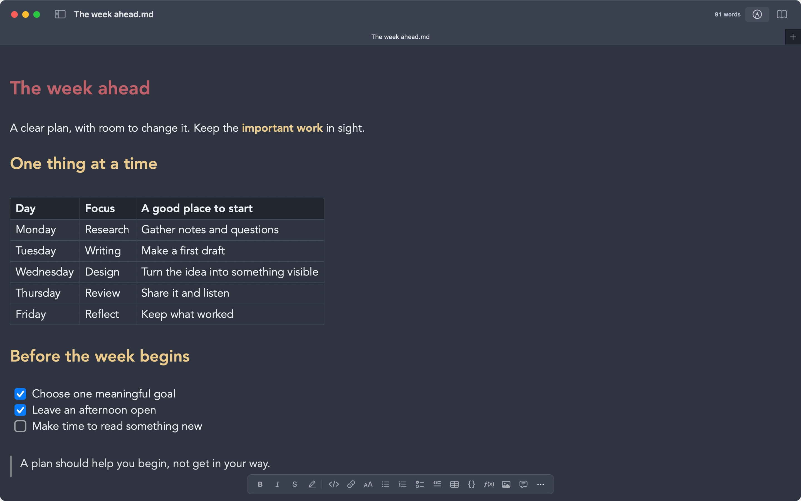
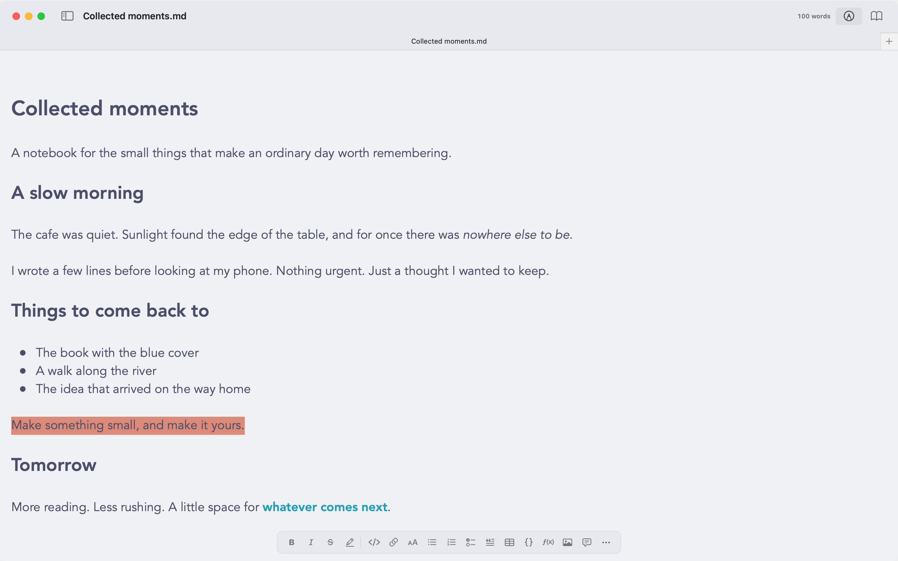
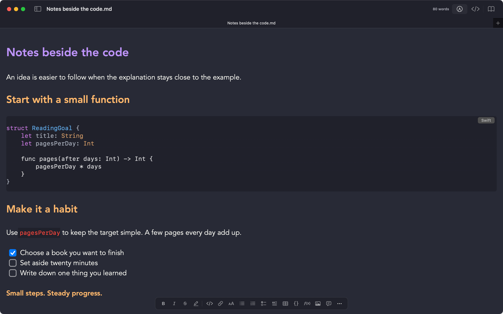
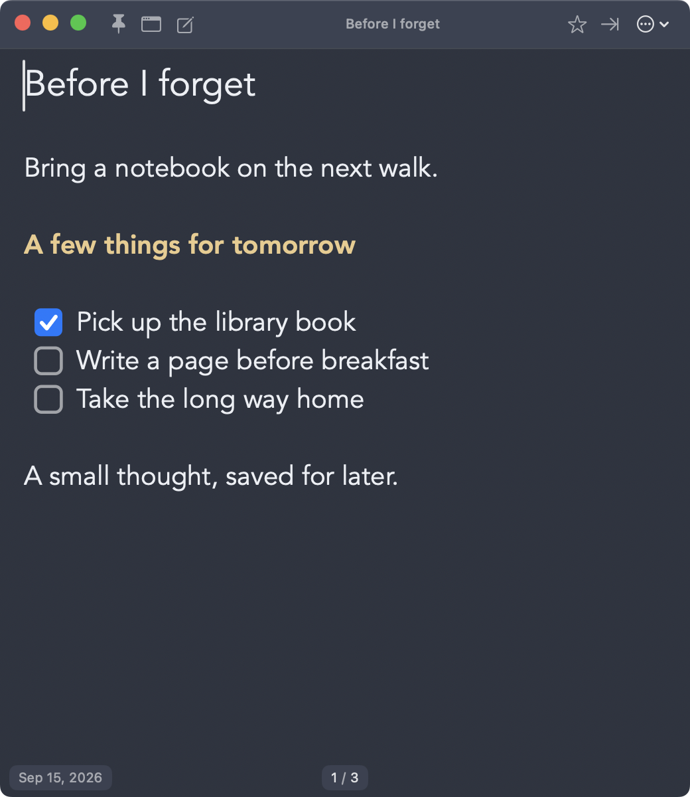
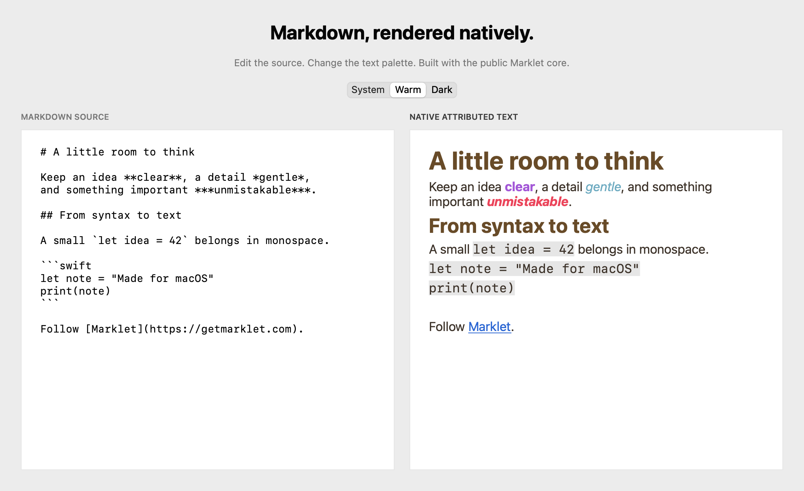

# Marklet

A lightweight native macOS Markdown editor.

Downloads and the open source parsing core for **Marklet**.

- Grab the latest version from the [Releases page](https://github.com/wakmail/Marklet/releases/latest).
- The direct download version checks for updates through Sparkle.

## Make it yours

Write with live formatting, edit tables in place, and choose a theme that feels right.

*Nord, with two editing mode controls and the floating formatting toolbar.*

<table>
  <tr>
    <td></td>
    <td></td>
  </tr>
  <tr>
    <td align="center">Catppuccin Latte</td>
    <td align="center">Dracula</td>
  </tr>
</table>

Find [Nord](https://github.com/insanum/obsidian_nord), [Catppuccin](https://github.com/catppuccin/obsidian), and [Dracula](https://github.com/dracula/obsidian) in Marklet's community theme browser. Preview their supported colors before choosing a theme.

[More screenshots: Marklet Warm, Catppuccin Mocha math, and Paper reading](SCREENSHOTS.md)

## Quick thoughts with Scraps

Keep a floating notepad close by for ideas, reminders, and small checklists. Enable Scraps in Settings when you want it. Your notes stay in Markdown files.

These screenshots show the full Marklet app. The standalone open source core demo is below.

## Open source core

Marklet’s Markdown parsing core is open source under GPLv3 with the additional
permission in [LICENSE.additional-terms](LICENSE.additional-terms). The full app
and its editor remain in a private repository.

The core is a standalone Swift package with no external package dependencies.
It exposes source ranges for emphasis, code, math, tables, and front matter, plus
basic native text rendering with configurable fonts and colors.
See [CORE.md](CORE.md) for usage, scope, and attribution.

Try the [native demo](Examples/CoreDemo): edit Markdown and switch text palettes.

Requires Swift 6.1 and macOS 14 or later. Run `swift test` to build and test the core.

  
[getmarklet.com](https://getmarklet.com)

