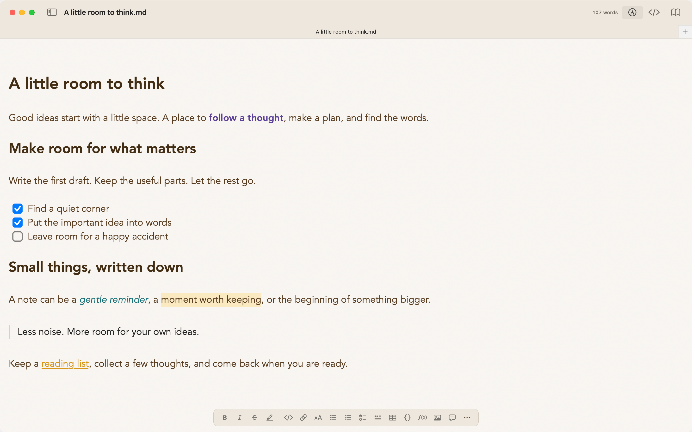
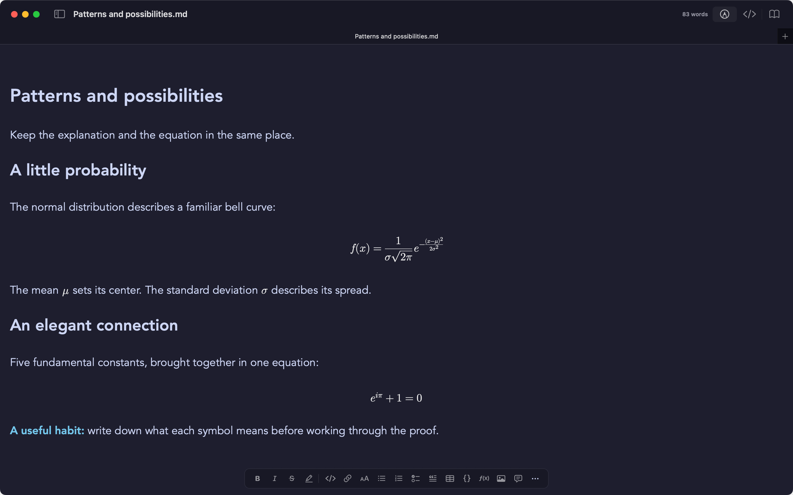
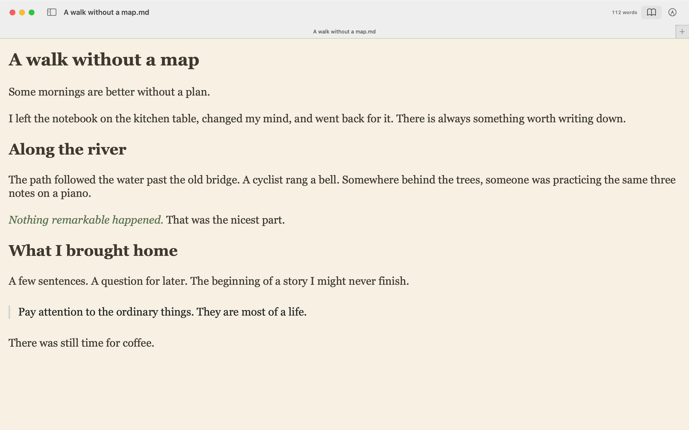

# More screenshots

Full window captures of Marklet, with different themes and writing styles. Select an image to see it at full size.

## Marklet Warm

Marklet Warm is based on the Primary theme, with warm paper colors and purple and teal accents. Shown here with live formatting, highlights, and checklists.

## Catppuccin Mocha math

Display equations and inline LaTeX in Catppuccin's dark Mocha palette.

## Paper reading

A quiet reading view with the Paper palette and Georgia typography.

[Back to Marklet](README.md)
